# ИДЗ 2
## Шаповалов Артём Сергеевич | БПИ-217 | Вариант 31

**Задание**

Первая задача об Острове Сокровищ. 

Шайка пиратов под предводительством Джона Сильвера высадилась на берег Острова Сокровищ. Не смотря на добытую карту старого Флинта, местоположение сокровищ по-прежнему остается загадкой, поэтому искать клад приходится практически на ощупь. Так как Сильвер ходит на деревянной ноге, то самому бродить по джунглям ему не с руки. Джон Сильвер поделил остров на участки, а пиратов на небольшие группы. Каждой группе поручается искать клад на одном из участков, а сам Сильвер ждет на берегу. Пираты, обшарив участок, возвращаются к Сильверу и докладывают о результатах. Если клад не найден, то пираты назначаются на другой участок. Требуется создать приложение, моделирующее действия Сильвера и пиратов. Примечание. Количество участков превышает число поисковых групп. Сильвер и каждая группа пиратов задаются соответствующими процессами.

**Решение на 4 балла:**

Разработать консольное приложение, в котором единый родительский процесс запускает требуемое число дочерних процессов.

Код программы с соответствующими комментариями [program_4.c](program_4.c).

Код на 4 балла выполнен в соответствии с требованием: Множество процессов взаимодействуют с использованием именованных POSIX семафоров. Обмен данными ведется через разделяемую память в стандарте POSIX.

Общий алгоритм:

Пользователь задает количество участков (AREA_COUNT), на которых может находиться клад. В начале все участки считаются свободными (area_status[i] = 0). Группа пиратов (PIRATE_GROUPS) ищет клад на этих участках.

В коде используется механизм совместного доступа к общей памяти и семафоров для синхронизации доступа групп пиратов к участкам земли. Каждый процесс группы пиратов (каждый из PIRATE_GROUPS процессов, созданных с помощью fork()) имеет доступ к общей памяти (shared_data *data) и семафору (sem_t *semaphore).

Код завершает работу самостоятельно, но также епредусмотрено прерывание комбинацией клавиш ^C.

Пираты работают следующим образом:

1. Процесс пытается захватить семафор и входит в критическую секцию, если это возможно (sem_wait()).
2. Проверяется, не был ли клад найден другой группой. Если клад уже найден, процесс освобождает семафор и завершает работу.
3. Иначе пираты отправляются на свободный участок земли для поиска клада.
4. Если все участки уже проверены, пираты освобождают семафор и завершают работу.
5. Иначе пираты начинают искать клад на своем участке.
6. Если пираты нашли клад, они обновляют данные в общей памяти и освобождают семафор (sem_post()), чтобы другие группы могли узнать, что клад найден. Затем они завершают работу.
7. Если клад не найден, пираты обновляют данные в общей памяти и освобождают семафор, чтобы другие группы могли начать поиск. Затем они возвращаются к шагу 1.

В конце работы всех процессов групп пиратов освобождается общая память (munmap()), семафор (sem_close() и sem_unlink()) и программа завершается.

Ниже приведен набор тестов, покрывающий основную логику программы и результаты тестов: 


- Тест с одним участком и одной пиратской группой:

```с
./program_4 1 1
```
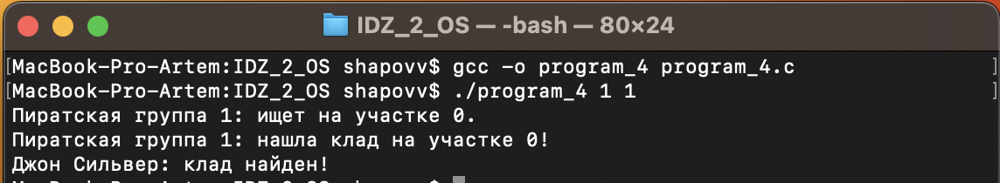
- Тест с двумя участками и одной пиратской группой:

```с
./program_4 2 1
```
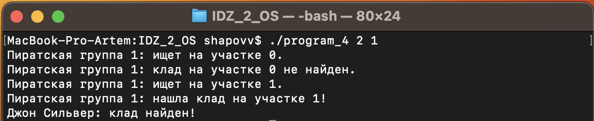

- Тест с несколькими участками и несколькими пиратскими группами:

```с
./program_4 5 3
```
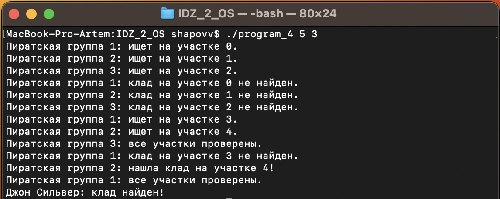

- Тест с большим количеством участков и меньшим количеством пиратских групп:

```с
./program_4 10 3
```
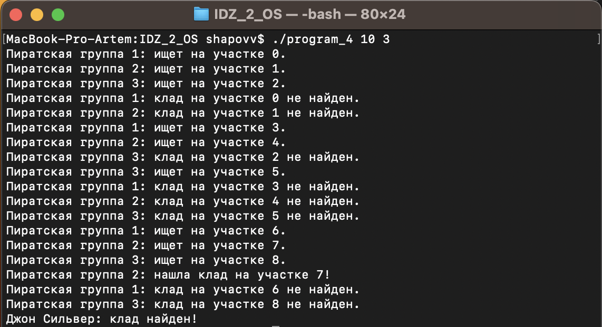

- Тест с большим количеством участков и большим количеством пиратских групп:

```с
./program_4 7 6
```
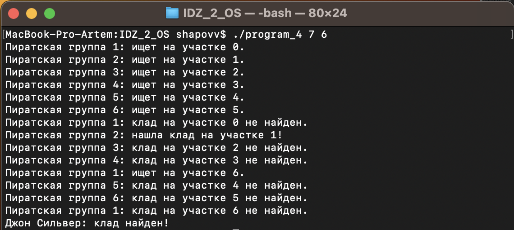


**Решение на 5 баллов:**

Код программы с соответствующими комментариями [program_5.c](program_5.c).

Код на 5 баллов выполнен в соответствии с требованием: Множество процессов взаимодействуют с использованием неименованных POSIX семафоров расположенных в разделяемой памяти. Обмен данными также ведется через разделяемую память в стандарте POSIX.

Ниже приведен набор тестов, покрывающий основную логику программы и результаты тестов:


- Тест с одним участком и одной пиратской группой:

```с
./program_5 1 1
```
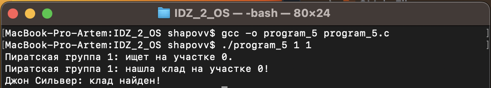
- Тест с двумя участками и одной пиратской группой:

```с
./program_5 2 1
```
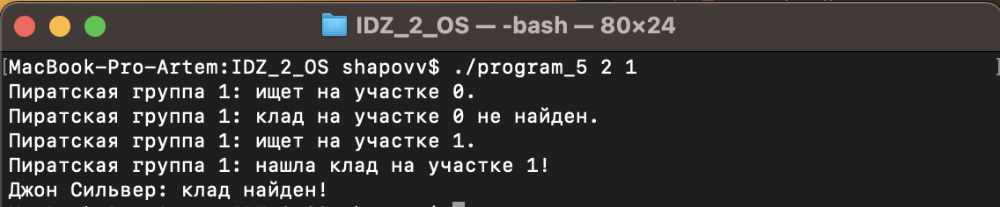

- Тест с несколькими участками и несколькими пиратскими группами:

```с
./program_5 5 3
```
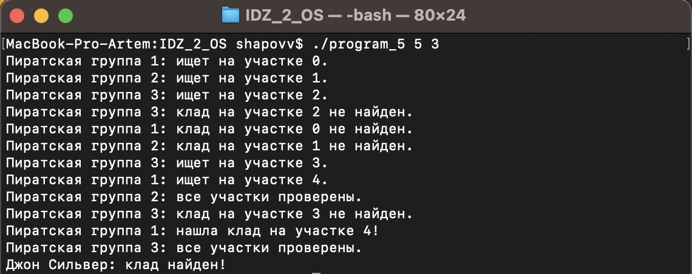

- Тест с большим количеством участков и меньшим количеством пиратских групп:

```с
./program_5 10 3
```
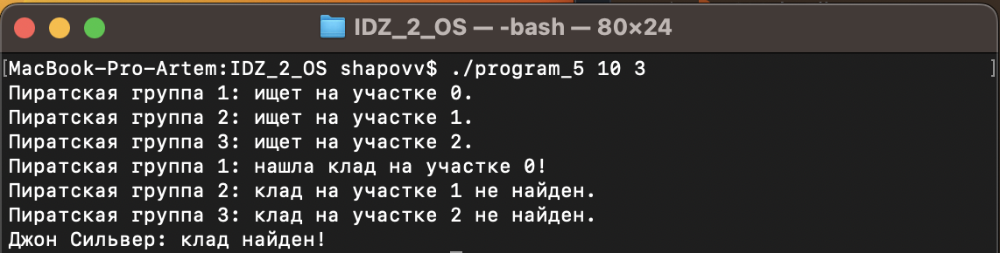

- Тест с большим количеством участков и большим количеством пиратских групп:

```с
./program_5 7 6
```
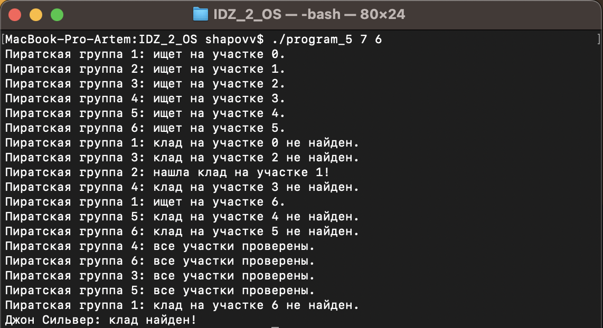

**Решение на 6 баллов:**

Код программы с соответствующими комментариями [program_6.c](program_6.c).

Код на 6 баллов выполнен в соответствии с требованием: Множество процессов взаимодействуют с использованием семафоров в стандарте UNIX SYSTEM V. Обмен данными ведется через разделяемую память в стандарте UNIX SYSTEM V.

Ниже приведен набор тестов, покрывающий основную логику программы и результаты тестов:

- Тест с одним участком и одной пиратской группой:

```с
./program_6 1 1
```
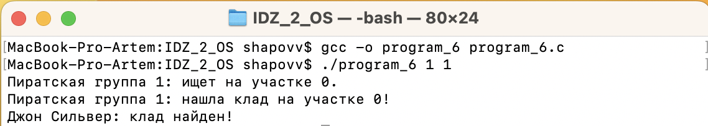
- Тест с двумя участками и одной пиратской группой:

```с
./program_6 2 1
```
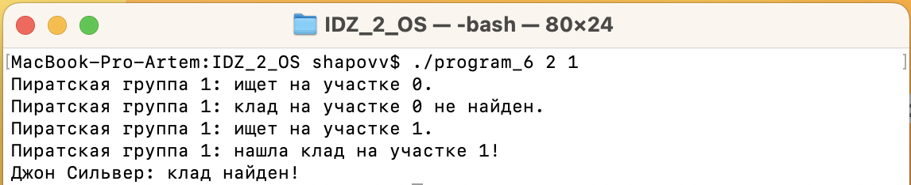

- Тест с несколькими участками и несколькими пиратскими группами:

```с
./program_6 5 3
```
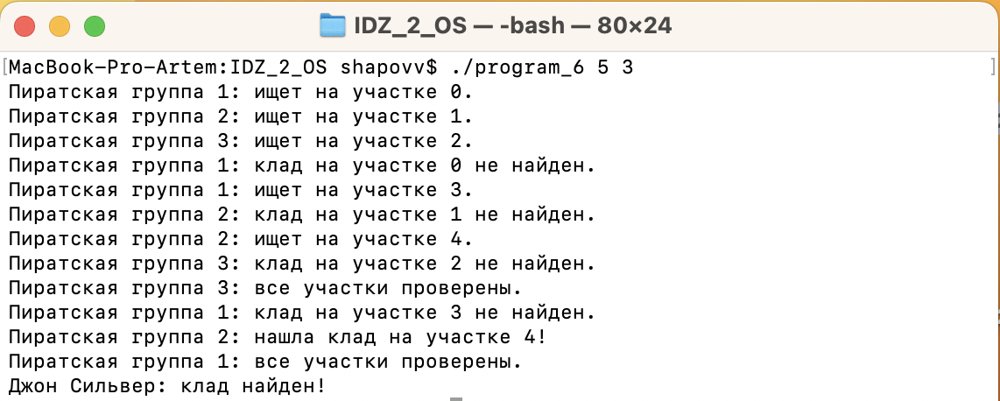

- Тест с большим количеством участков и меньшим количеством пиратских групп:

```с
./program_6 10 3
```
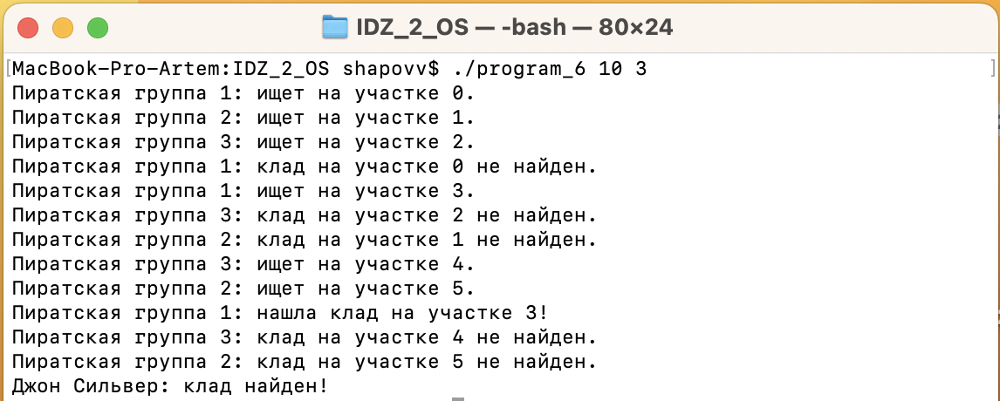

- Тест с большим количеством участков и большим количеством пиратских групп:

```с
./program_6 7 6
```
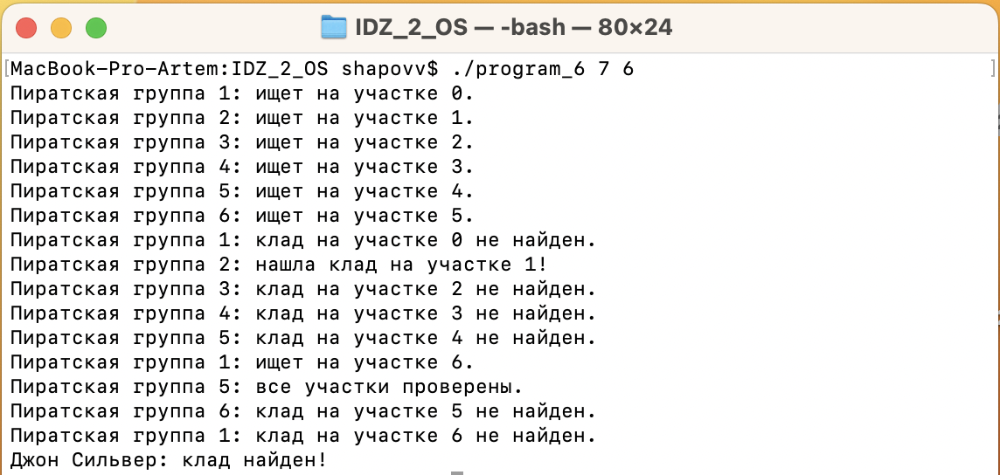

**Решение на 7 баллов:**

Код программ с соответствующими комментариями [main_program.c](program_7/main_program.c) и [pirate_group_program.c](program_7/pirate_group_program.c).

Код на 7 баллов выполнен в соответствии с требованием: Множество независимых процессов взаимодействуют с использованием именованных POSIX семафоров. Обмен данными ведется через разделяемую память в стандарте POSIX.

Компиляция и запуск:

```с
gcc main_program.c -o main_program -lrt -lpthread
gcc pirate_group_program.c -o pirate_group_program -lrt -lpthread
./main_program <AREA_COUNT> <PIRATE_GROUPS>
```

Ниже приведен набор тестов, покрывающий основную логику программы и результаты тестов:

- Тест с одним участком и одной пиратской группой:

```с
./main_program 1 1
```
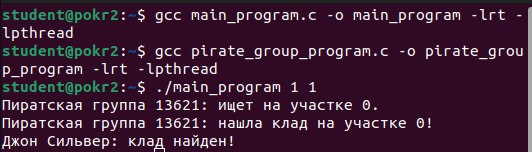
- Тест с двумя участками и одной пиратской группой:

```с
./main_program 2 1
```
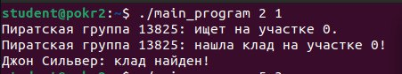

- Тест с несколькими участками и несколькими пиратскими группами:

```с
./main_program 5 3
```
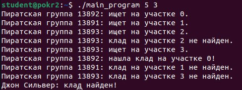

- Тест с большим количеством участков и меньшим количеством пиратских групп:

```с
./main_program 10 3
```
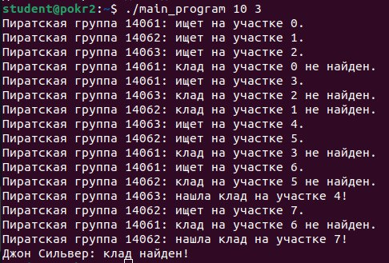

- Тест с большим количеством участков и большим количеством пиратских групп:

```с
./main_program 7 6
```
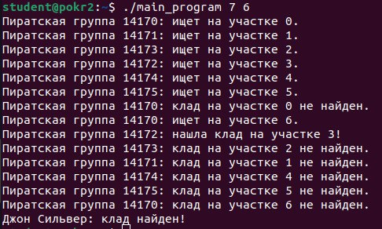